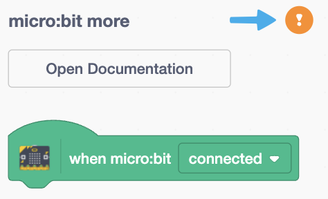

# micro:bit

## 认识 micro:bit

BBC micro:bit是一台口袋大小的计算机，用来向你介绍软件和硬件是如何一起工作的。 它有一个 LED 灯光显示屏、按键、传感器和许多输入/输出功能，在程序控制下，与你和你的世界交互。

详细查看 [micro:bit](https://microbit.org/get-started/first-steps/introduction/)，购买地址：[淘宝链接](https://item.taobao.com/item.htm?id=562621059348)。

### V2

### V1

## micro:bit 扩展

micro:bit 扩展是基于 Scratch 3.0 开发的扩展模块，通过蓝牙连接 micro:bit 开发板，对开发进行实时编程。在实时编程时可以及时看到运行效果并能与电脑进行交互，编程时需保持计算机和开发板的蓝牙连接。

### 固件

要求 micro:bit 开发板下载最新定制固件（[scratch-microbit-1.2.0.hex](./firmware/scratch-microbit-1.2.0.hex)），可以同时支持 micro:bit V1 开发板 和 micro:bit V2 开发板。

#### 拖放安装固件

下载好固件后，将 micro:bit 开发板准备好（不要连接电脑 USB 接口），然后按下面的步骤安装固件：

1. 将 micro:bit 开发板插入 PC 的 USB 接口（不用按 BOOTSEL 按钮）。
2. micro:bit 开发板会被识别为大容量存储设备。
3. 将下载的固件文件（HEX 文件）放入 MICROBIT 卷上。
4. micro:bit 开发板将自动重启，然后就开始编程了。

接下来就可以使用 micro:bit 扩展对 micro:bit 开发板进行编程了。

### 连接 micro:bit

| 点击感叹号开始连接 | 选择 micro:bit 开发板 |
| :---: | :---: |
|  |  |

现在开始享受愉快的编程吧！
