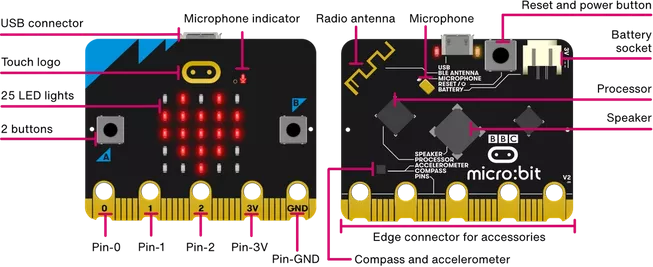
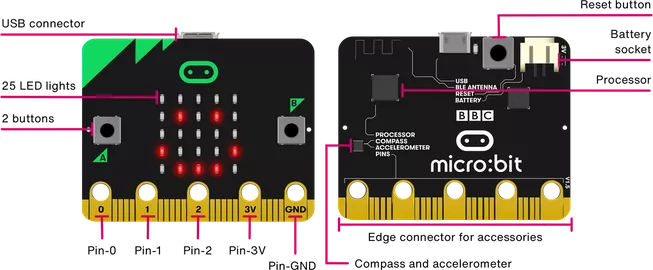
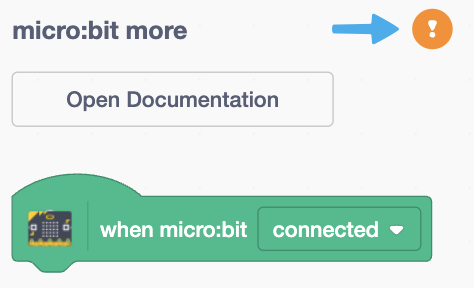
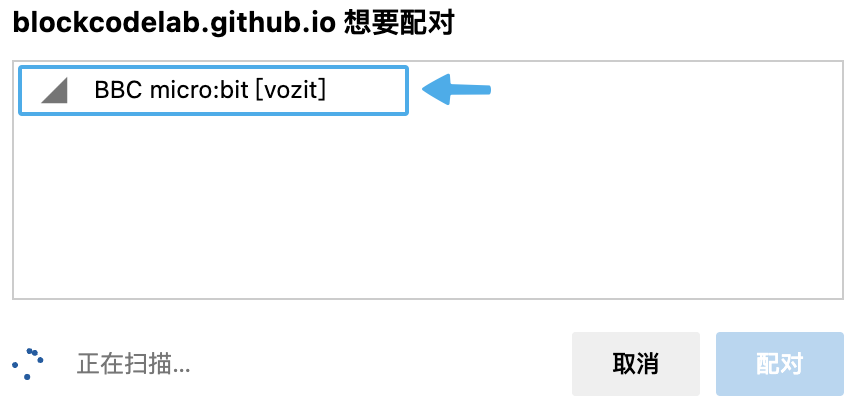

# micro:bit more

## Meet micro:bit

The BBC micro:bit is a pocket-sized computer that introduces you to how software and hardware work together. It has an LED light display, buttons, sensors and many input/output features that, when programmed, let it interact with you and your world.

See [micro:bit](https://microbit.org/get-started/first-steps/introduction/).

### V2

### V1

## micro:bit more extension

micro:bit more extension is an extension module developed based on Scratch 3.0. On the basis of the Scratch 3.0 micro:bit official extension, the micro:bit more extension adds more capabilities that can programmatically control the functions of the development board.

In real-time programming, you can see the running effect in time and interact with the computer. The calculation and the development board communicate through Bluetooth. The Bluetooth connection between the computer and the development board should be maintained during programming.

### Firmware

The micro:bit development board is required to download the latest custom firmware ([microbit-more-0.2.5.hex](./firmware/microbit-more-0.2.5.hex)), It can support both micro:bit V1 development board and micro:bit V2 development board, but some functions only support micro:bit V2 development board.

#### Drag and drop to install firmware

After downloading the firmware, prepare the micro:bit development board (do not connect the USB port of the computer), and then install the firmware by following the steps:

1. Insert the micro:bit development board into the USB port of the PC (do not press the BOOTSEL button).
2. micro:bit development board will be recognized as mass storage device.
3. Put the downloaded firmware file (HEX file) on the MICROBIT volume.
4. The micro:bit board will restart automatically and then need to be initialized.
5. According to the LED array, tilt micro:bit in different directions until all LED lights are on, then start programming.

Next you can program the micro:bit board using the micro:bit more extension.

### Connecting to micro:bit

| Click the exclamation mark to start the connection | Select micro:bit board |
| :---: | :---: |
|  |  |

Now start having fun coding!
 