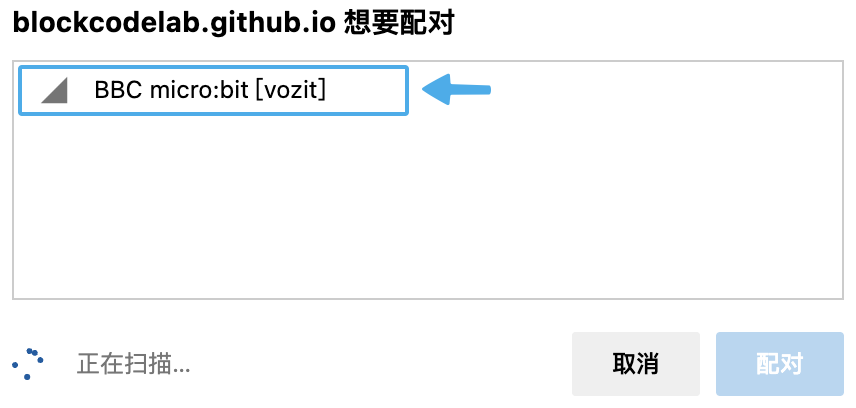

# micro:bit more

## 認識 micro:bit

BBC micro:bit 是一台袖珍型電腦，它會向您介紹軟體和硬體如何共同運作。 它有一個 LED 燈顯示器、按鍵、感測器和許多輸入/輸出功能，當編寫程式碼時，它可以與您和您的世界互動。

詳細查看 [micro:bit](https://microbit.org/get-started/first-steps/introduction/)，購買地址：[淘寶鏈接](https://item.taobao.com/item.htm?id=562621059348)。

### V2

### V1

## micro:bit more 擴展

micro:bit more 擴展是基於 Scratch 3.0 開發的擴展模塊，在 Scratch 3.0 micro:bit 官方擴展的基礎上，micro:bit more 擴展增加了更多可以編程控制開發板功能的能力。

使用擴展對 micro:bit 開發板進行實時編程，在實時編程時可以及時看到運行效果並能與電腦進行交互，計算算和開發板通過藍牙通訊，編程時需保持計算機和開發板的藍牙連接。

### 固件

要求 micro:bit 開發板下載最新定製固件（[microbit-more-0.2.5.hex](./firmware/microbit-more-0.2.5.hex)），可以同時支持 micro:bit V1 開發板 和 micro:bit V2 開發板，但是部分功能只支持 micro:bit V2 開發板。

#### 拖放安裝固件

下載好固件後，將 micro:bit 開發板準備好（不要連接電腦 USB 接口），然後按下面的步驟安裝固件：

1. 將 micro:bit 開發板插入 PC 的 USB 接口（不用按 BOOTSEL 按鈕）。
2. micro:bit 開發板會被識別為大容量存儲設備。
3. 將下載的固件文件（HEX 文件）放入 MICROBIT 捲上。
4. micro:bit 開發板將自動重啟，然後需要進行初始化。
5. 根據 LED 陣列的指示，往不同方向傾斜 micro:bit 直到所有 LED 燈都點亮，然後就開始編程了。

接下來就可以使用 micro:bit more 擴展對 micro:bit 開發板進行編程了。

### 連接 micro:bit

| 點擊感嘆號開始連接 | 選擇 micro:bit 開發板 |
| :---: | :---: |
|  |  |

現在開始享受愉快的編程吧！
