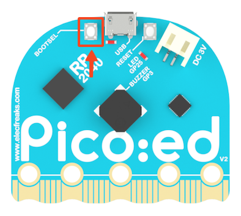

# Pico:ed V2

Pico:ed V2 development board is an educational development board developed by Enfu Technology based on the Raspberry PI Pico. We use the widely acclaimed RP2040 microcontroller. On the basis of the first generation, we specially add a reset button, which is more convenient for users to operate and use. Adopt a more rounded shape: the head is changed into a curved shape, and the edge of the pin is designed in a wavy shape, so that the user is not easy to hurt his hands when using. Retain two programmable buttons and firmware burning button, separate power supply interface and USB connection interface, onboard 7×17 LED lattice screen, can display more patterns and text.

## Meet Pico:ed V2

Carefully check the [Elecfreaks technology Pico: Ed V2 products help manual] (http://wiki.elecfreaks.com/en/pico/picoed/meet-pico-ed-v2), buy address: link (https://shop.elecfreaks.com/products/elecfreaks-pico-ed-v2).

| front | back |
| :---: | :---: |
|  |  |

## Pico:ed V2 extension

The Pico:ed V2 extension is an extension module developed based on Scratch 3.0, which enables Scratch 3.0 to have the function of developing the Pico:ed V2 development board.

Real-time programming or off-line programming of Pico:ed V2 development board with extension (not yet open), which can see the running effect and interact with the computer in time during real-time programming; After the real-time programming is completed, it can be directly downloaded to the Pico:ed V2 development board, and it can be run offline. In offline operation, you do not need to connect to the computer, but also lose the ability to interact with the computer.

### Firmware

The Pico:ed V2 development board is required to download the latest custom firmware: [kaluma-rp2-picoed-1.1.0-beta.2.uf2](./firmware/kaluma-rp2-picoed-1.1.0-beta.2.uf2)

#### Drag and drop to install firmware

Once the firmware is downloaded, get the Pico:ed V2 development board ready (without connecting the USB port to your computer), and then install the firmware as follows:

1. Press and hold the BOOTSEL button on the back of the Pico:ed V2 development board, then plug the Pico:ed V2 development board into the USB port of the PC, and release the BOOTSEL button.
2. The Pico:ed V2 development board will be recognized as a mass storage device.
3. Put the downloaded firmware file (UF2 file) on the RPI-RP2 volume.
4. The Pico:ed V2 development board will automatically restart and programming will begin.

Next you can program the Pico:ed V2 development board using the Pico:ed V2 extension.

### Connect Pico:ed V2

| Click the exclamation mark to start the connection | Select Pico:ed V2 board |
| :---: | :---: |
|  |  |

Now have fun programming!

## Programming

### Pins

