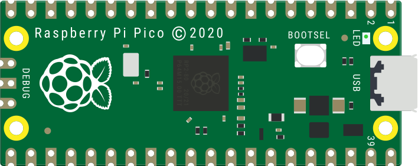
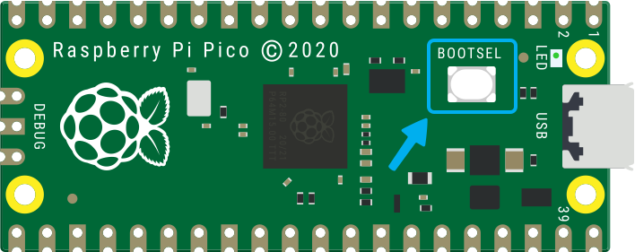
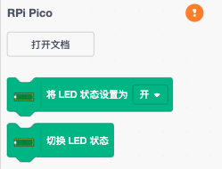
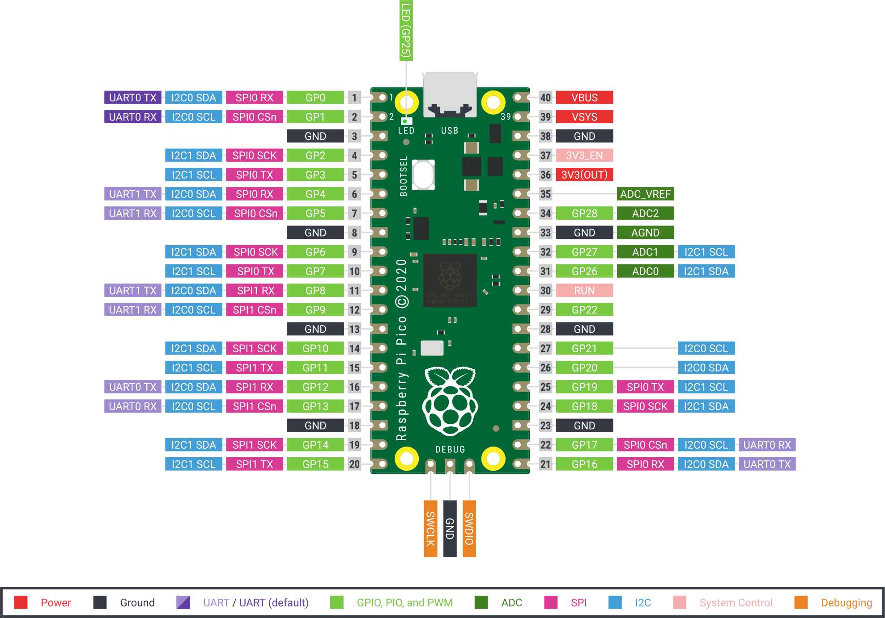

# 樹莓派 Pico

樹莓派 Pico 系列是一系列微型、快速和多功能的電路板，使用 RP2040 芯片構建，RP2040 芯片是由樹莓派在英國設計的旗艦微控制器芯片。

## 認識樹莓派 Pico

詳細查看[樹莓派 Pico 產品頁](https://www.raspberrypi.com/products/raspberry-pi-pico/)，購買地址：[淘寶鏈接](https://item.taobao.com/item.htm?id=697019187951)。

## 樹莓派 Pico 擴展

樹莓派 Pico 擴展是基於 Scratch 3.0 開發的擴展模塊，可以讓 Scratch 3.0 具備對樹莓派 Pico 開發板進行開發的功能。

使用擴展對樹莓派 Pico 開發板進行實時編程或離線編程（暫未開放），在實時編程時可以及時看到運行效果並能與電腦進行交互；實時編程完成後直接下載到樹莓派 Pico 開發板中就可以離線運行，離線運行可以不用連接電腦，但也失去了與電腦的交互能力。

### 固件

要求樹莓派 Pico 開發板下載最新 Kaluma 固件（[kaluma-rp2-pico-1.1.0-beta.2.uf2](./firmware/kaluma-rp2-pico-1.1.0-beta.2.uf2)）。

#### 拖放安裝固件

下載好固件後，將樹莓派 Pico 開發板準備好（不要連接電腦 USB 接口），然後按下面的步驟安裝固件：

1. 按住樹莓派 Pico 開發板背面的 BOOTSEL 按鈕，然後將樹莓派 Pico 開發板插入 PC 的 USB 接口，然後鬆開 BOOTSEL 按鈕。
2. 樹莓派 Pico 開發板會被識別為大容量存儲設備。
3. 將下載的固件文件（UF2 文件）放入 RPI-RP2 捲上。
4. 樹莓派 Pico 開發板將自動重啟，然後就開始編程了。

接下來就可以使用樹莓派 Pico 擴展對樹莓派 Pico 開發板進行編程了。

### 連接樹莓派 Pico

| 點擊感嘆號開始連接 | 選擇樹莓派 Pico 開發板 |
| :---: | :---: |
|  |  |

現在開始享受愉快的編程吧！

## 編程

### 引腳

